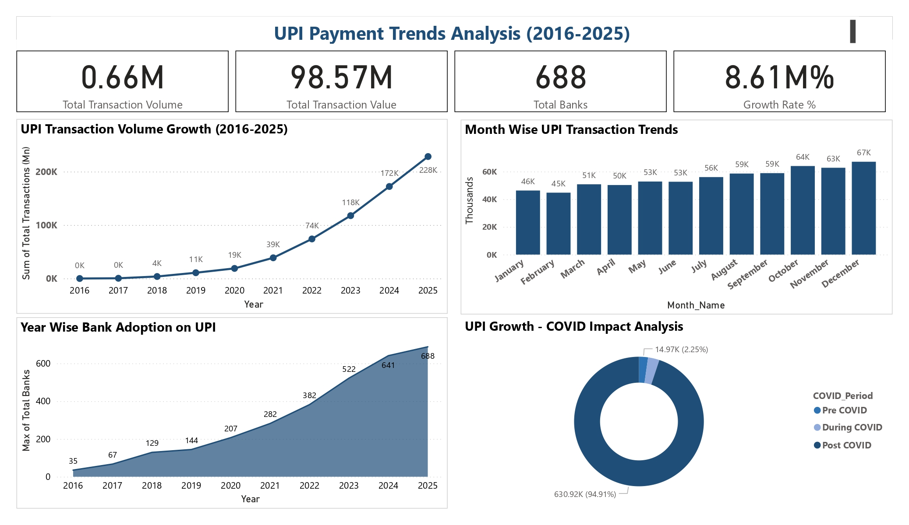

# UPI Payment Trends Analysis (2016-2025)



## About This Project

I built this project to analyse how UPI payments have grown in India over the last 10 years. I used real government data from NPCI website and applied the complete data analysis workflow — from collecting raw data to building a final dashboard.

---

## What I Analysed

- How UPI transaction volume and value grew year by year
- Which months have the highest UPI activity
- How many banks joined UPI over the years
- How COVID-19 impacted digital payment adoption in India

---

## Key Findings

- UPI grew from almost 0 transactions in 2016 to **228 billion+ transactions** by 2025
- Number of banks on UPI increased from **21 to 688**
- Post COVID period (2021-2025) contributed around **95% of total UPI transactions**
- **December** is consistently the busiest month for UPI transactions
- Strong correlation (0.98+) between bank adoption and transaction growth

---

## Tools I Used

| Tool | What I used it for |
|------|---------|
| Excel | Collected and combined 10 yearly data files |
| Python | Data cleaning, EDA, and visualizations |
| MySQL | Advanced SQL queries and analysis |
| Power BI | Built the final interactive dashboard |

---

## Dataset

I downloaded this data directly from the official NPCI website:
[NPCI UPI Product Statistics](https://www.npci.org.in/what-we-do/upi/product-statistics)

- **Period covered:** April 2016 to December 2025
- **Total records:** 117 months of data
- **Columns:** Month, Financial Year, Bank Count, Transaction Volume (Mn), Transaction Value (Cr), Year, Month Name, Month Number

---

## Steps I Followed

1. **Data Collection** — Downloaded yearly Excel files from NPCI and combined them into one CSV
2. **Data Cleaning** — Fixed data types, removed inconsistencies, created new columns like Year, Month Name, Month Number
3. **Exploratory Data Analysis** — Analysed trends, patterns and correlations using Python
4. **SQL Analysis** — Wrote 15 queries including growth rates, rankings, running totals and COVID impact analysis
5. **Dashboard** — Built an interactive Power BI dashboard with 4 KPI cards and 4 charts

---

## Project Structure

```
UPI-Payment-Trends-Analysis/
├── Data/
│   ├── upi_data.csv
│   └── upi_cleaned_data.csv
├── Notebooks/
│   └── upi_analysis.ipynb
├── SQL/
│   └── upi_analysis_queries.sql
├── Visuals/
│   └── (all charts + dashboard screenshot)
├── UPI_Payment_Analysis.pbix
└── README.md
```

---

## Dashboard

The Power BI dashboard has:
- 4 KPI cards — Total Transactions, Total Value, Total Banks, Growth Rate %
- Year wise UPI growth (line chart)
- Month wise transaction trends (bar chart)
- Bank adoption over years (area chart)
- COVID impact analysis (donut chart)

---

## How to Run

1. Clone this repo
2. Open `Notebooks/upi_analysis.ipynb` in Jupyter Notebook
3. Open `SQL/upi_analysis_queries.sql` in MySQL Workbench
4. Open `UPI_Payment_Analysis.pbix` in Power BI Desktop

---

## Connect With Me

**LinkedIn:** [https://www.linkedin.com/in/murali-krishna-narukula-297428272/]

